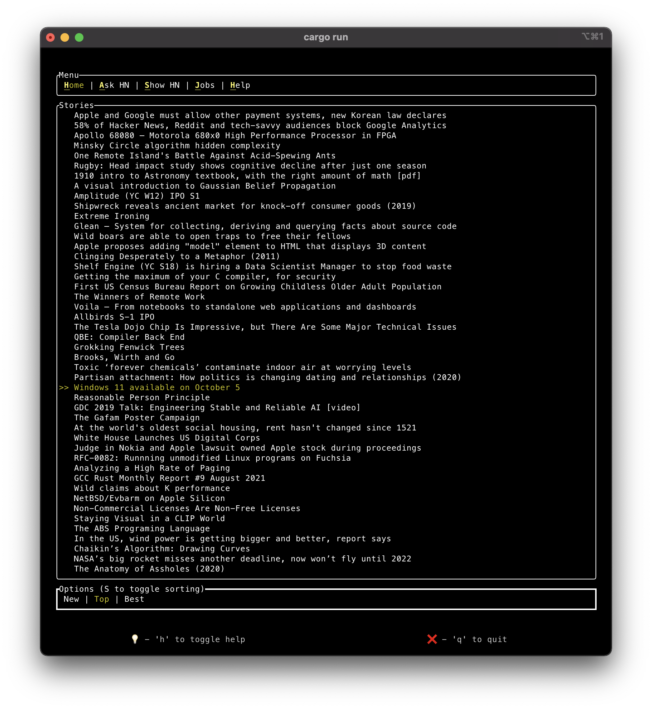
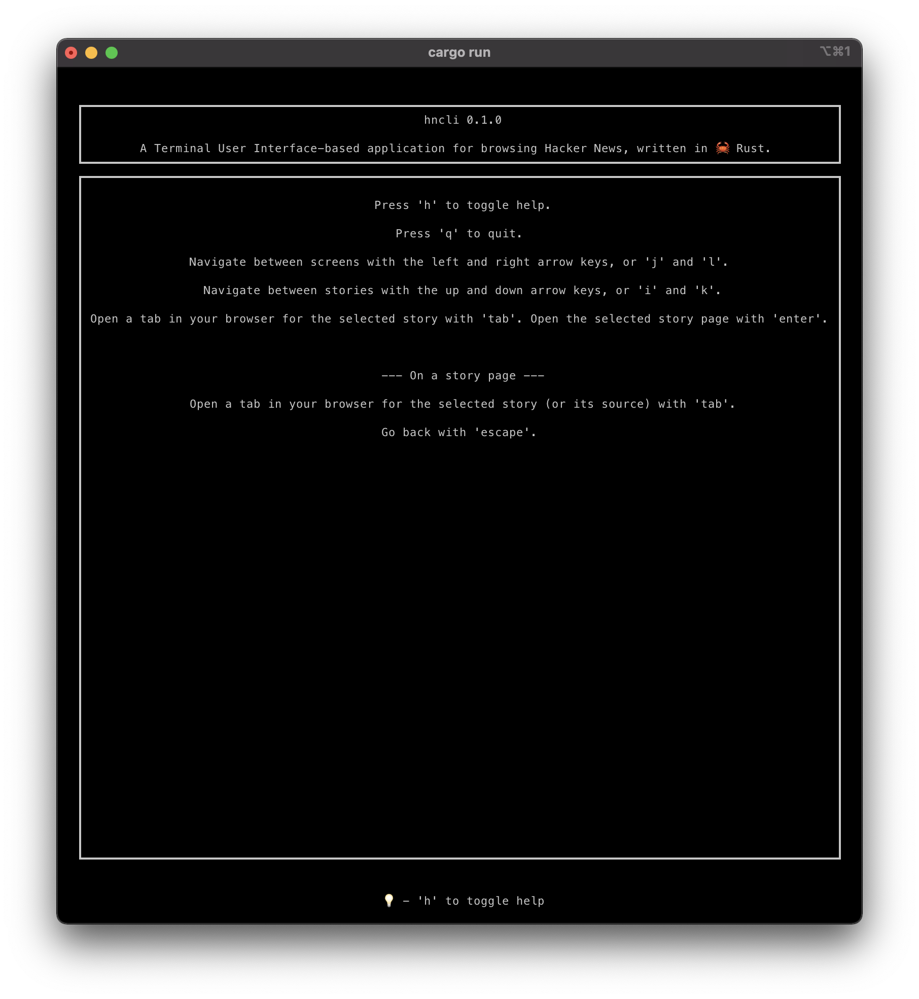

# hncli

A Terminal User Interface-based application for browsing Hacker News, written in 🦀 Rust.

## Screenshots

|                  Home Screen                  |                  Help Screen                  |
| :-------------------------------------------: | :-------------------------------------------: |
|  |  |

## Usage

### With the Rust toolchain

```sh
cd app
cargo run --release
```

### With Docker

```sh
docker build -t hncli .
docker run -it hncli
```

### Controls

After launching the application, use the arrow keys and 'Enter' to navigate and read the contextual help at the bottom of the screen (can be disabled from the settings screen).

There is a help screen, accessible in any screen by the key 'h', to guide you along.

## Caveats

- Expect bugs, some minor some rather critical but which should be rare, here and there in the current features scope.
- Really long posts or comments cannot be fully displayed yet.
- The control and shift key modifiers do not work properly in some cases.
- I have no access to hardware with smaller screens, so the terminal full screen experience may be compromised on such devices (should be good on 14" devices and more, depending on screen definition).

## Blog Posts

**The website itself is very Work In Progress**

- [An Hacker News Terminal UI: concept and road to release](https://www.newstackwhodis.com/blog/hncli-1-concept)
- [An Hacker News Terminal UI: deep-dive into the Rust architecture](https://www.newstackwhodis.com/blog/hncli-2-architecture)
